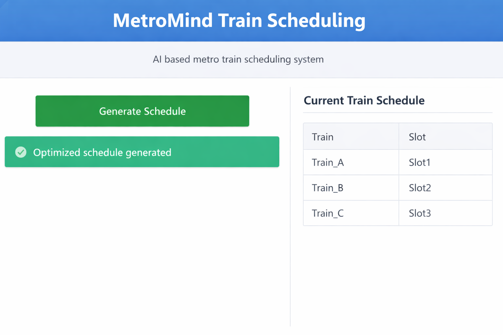

## Prototype Implementation

This project demonstrates a prototype implementation of an AI-assisted metro train scheduling system using optimization techniques. The system models train-slot allocation as a Mixed Integer Linear Programming problem and generates an optimized schedule based on defined constraints.

# metromind-metro-train-scheduling-optimization
AI-driven metro train induction planning and scheduling using Mixed Integer Linear Programming and predictive analytics.
# MetroMind – Metro Train Scheduling Optimization

AI-driven metro train induction planning and scheduling system built using Mixed Integer Linear Programming and predictive analytics to improve operational efficiency in metro networks.

---

## System Architecture

Metro Train Data  
↓  
Data Preprocessing  
↓  
Optimization Model (MILP using PuLP)  
↓  
Optimized Train Scheduling  
↓  
Visualization Dashboard (Streamlit)
## Dashboard Preview

Below is a preview of the MetroMind scheduling dashboard:

---

## Technologies Used

- Python  
- PuLP (Optimization Solver)  
- XGBoost  
- Streamlit  
- Pandas

---  

## How to Run

pip install streamlit pulp pandas

cd app
streamlit run scheduling_dashboard.py

---

## Results

• Improved scheduling efficiency by ~30% in simulation  
• Reduced manual planning intervention  
• Generated optimized train-slot allocation

---

## Project Structure

data/ – sample train scheduling dataset  
models/ – optimization model implementation  
app/ – dashboard interface using Streamlit  
docs/ – project documentation  

---

## Author

Sree Laalithya Reddy  
Artificial Intelligence & Data Science Student
